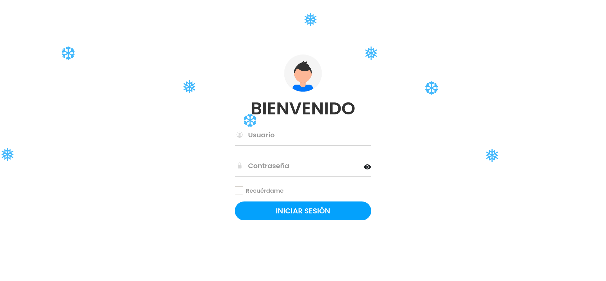
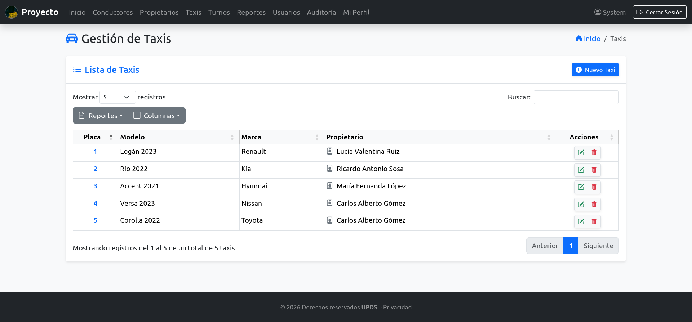
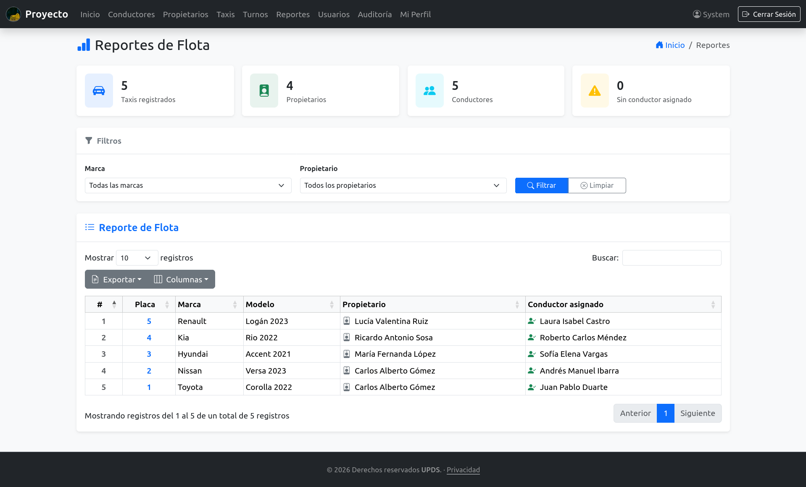
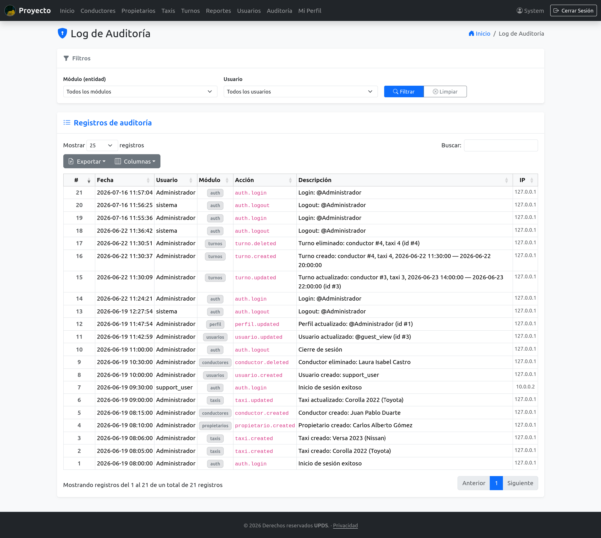

<h1 align="center">🚕 Gestión de Flota — Proyecto Aplicación Web PHP</h1>

<p align="center">
  Sistema de administración de taxis, propietarios, conductores y turnos.<br>
  PHP puro con arquitectura N-Layer, framework interno propio y panel administrativo completo.
</p>

<p align="center">
  
  
  
  
  
  
  
  <a href="https://github.com/jandrescodes/Proyecto_AplicacionWeb_PHP/actions/workflows/tests.yml">
    
  </a>
</p>

<p align="center">
  <a href="#-capturas">Capturas</a> ·
  <a href="#-características">Características</a> ·
  <a href="#-tecnologías">Tecnologías</a> ·
  <a href="#️-instalación">Instalación</a> ·
  <a href="#-módulos-y-rutas">Módulos</a> ·
  <a href="#-arquitectura">Arquitectura</a> ·
  <a href="#-seguridad">Seguridad</a> ·
  <a href="#-tests">Tests</a>
</p>

---

## 📸 Capturas

### Login

Autenticación con sesión, CSRF y opción de "recuérdame".



### Panel de Taxis

Gestión integral de la flota: alta, edición y eliminación con confirmación vía SweetAlert2.



### Reportes de Flota

Estadísticas generales y tabla combinada (taxi + propietario + conductor) con filtros server-side y exportación PDF/Excel/CSV.



### Log de Auditoría

Registro inmutable de todas las acciones del sistema, con filtros por módulo y usuario.



## ✨ Características

- **Arquitectura N-Layer:** Presentation → Application → Domain → Infrastructure, con framework interno (`core/`) desacoplado de la lógica de negocio.
- **Modelos de dominio ricos:** cada modelo expone `Model::create()` con sus propias validaciones; los Services orquestan reglas cross-domain (existencia de FK, solapamientos) y delegan el resto al modelo.
- **Sin JOINs cross-domain:** los repositorios consultan una sola tabla; el ensamblado entre dominios ocurre en memoria en el Service (p. ej. `TaxiService::allWithOwner()`).
- **Vistas tipadas:** `View::renderWith()` recibe siempre un `ViewModel` tipado — nunca `extract()` ni arrays crudos.
- **Gestión AJAX de eliminación:** Fetch API + SweetAlert2, con `delete.js` propio por módulo y mensaje de confirmación contextual (nombre/placa/usuario del registro).
- **Perfil de usuario:** cualquier usuario autenticado edita su nombre, correo y contraseña en `/perfil`; el id siempre se resuelve vía `Auth::id()`, nunca por URL o POST (IDOR-safe).
- **Reportes de flota:** estadísticas generales + tabla combinada (taxi + propietario + conductor), filtros server-side por marca/propietario, exportación PDF/Excel/CSV/Print vía DataTables Buttons.
- **Asignación de turnos:** conductor + taxi + rango horario, con validación de solapamiento cross-domain (un conductor o un taxi no pueden tener dos turnos activos simultáneos).
- **Log de auditoría inmutable:** instrumenta login/logout, CRUD de todos los módulos y cambios de perfil, con filtros por entidad y usuario.
- **Recuérdame:** cookie persistente (30 días por defecto), token hasheado con SHA-256 y rotado en cada uso.
- **Manejo de errores HTTP:** vistas dedicadas para 404, 500 y errores genéricos; nunca se expone un stack trace al usuario.
- **Tests automatizados:** suite PHPUnit 10 sobre modelos de dominio y services, ejecutada en CI (GitHub Actions) en PHP 8.2 y 8.3.

## 🛠 Tecnologías

| Categoría        | Stack                                             |
| ---------------- | ------------------------------------------------- |
| Backend          | PHP 8.x (PDO), framework interno propio (`core/`) |
| Base de datos    | MySQL                                             |
| Frontend         | Bootstrap 5 & Icons, JavaScript ES6+              |
| Tablas dinámicas | DataTables                                        |
| Notificaciones   | SweetAlert2                                       |
| Tests            | PHPUnit 10                                        |
| Dependencias     | Composer                                          |
| Logging          | Monolog (rotación diaria, 14 días)                |

## 📋 Requisitos

- XAMPP (Apache + MySQL)
- PHP 8.1 o superior
- MySQL
- [Composer](https://getcomposer.org/)

## ⚙️ Instalación

1. Clonar o copiar el proyecto en el directorio servido por Apache, por ejemplo:
   ```bash
   /opt/lampp/htdocs/Proyecto_AplicacionWeb_PHP
   ```
2. Instalar dependencias PHP:
   ```bash
   composer install --no-dev --optimize-autoloader   # producción
   composer install                                  # desarrollo (incluye PHPUnit)
   ```
3. Importar la base de datos en MySQL/phpMyAdmin, en orden:
   ```bash
   database/schema.sql
   database/seeder.sql
   ```
4. Copiar `.env.example` a `.env` y configurar las credenciales de base de datos (ver [Variables de entorno](#-variables-de-entorno)).
5. Dar permisos de escritura al directorio de logs:

   | SO            | Comando                                                             |
   | ------------- | ------------------------------------------------------------------- |
   | Linux (XAMPP) | `chown -R daemon:daemon storage/logs`                               |
   | macOS (XAMPP) | `chmod -R 777 storage/logs`                                         |
   | Windows       | no requiere acción — XAMPP ya tiene acceso de escritura por defecto |

6. Iniciar Apache y MySQL desde el panel de XAMPP.
7. Abrir en el navegador:
   ```
   http://localhost/Proyecto_AplicacionWeb_PHP/public/
   ```

> **Nota sobre `.htaccess` y `APP_URL`:** el único `.htaccess` activo vive en `public/` y enruta todo a `index.php`. `APP_URL` debe incluir siempre el sufijo `/public` (ver ejemplo abajo). No existe `.htaccess` en la raíz del proyecto.

## 🔑 Variables de entorno

```env
# Base de datos
DB_HOST=localhost
DB_DATABASE=proyecto
DB_USERNAME=root
DB_PASSWORD=
APP_URL=http://localhost/Proyecto_AplicacionWeb_PHP/public

# Sesión
SESSION_LIFETIME=120        # duración en minutos (default: 120)

# Recuérdame
REMEMBER_ME_ENABLED=true
REMEMBER_ME_TTL_DAYS=30     # duración de la cookie en días (default: 30)
REMEMBER_ME_COOKIE_NAME=remember_token
```

## 🧪 Tests

```bash
composer test
```

Suite de unit tests puros (sin base de datos ni Apache) sobre modelos de dominio y services. GitHub Actions la ejecuta automáticamente en cada push y PR a `master`.

## 📁 Estructura del proyecto

```
app/
  Presentation/
    Controllers/       ← Controladores HTTP
    Http/              ← Request, Response
    ViewModels/        ← ViewModels tipados (uno por vista)
    Views/             ← Plantillas PHP
  Application/
    Contracts/         ← Interfaces de servicios
    Services/          ← Servicios de aplicación (orquestación)
  Domain/
    Models/            ← Modelos de dominio con Model::create() y validaciones
  Infrastructure/
    Contracts/         ← Interfaces de repositorios
    Persistence/
      Repositories/    ← Implementaciones PDO
      Database.php     ← Singleton PDO
core/                  ← Framework interno (Router, Container, Auth, Csrf, Flash, View…)
config/
  bindings.php         ← Registro de dependencias (DI container)
bootstrap/
  app.php              ← Bootstrap: autoloader, container, router
routes/
  web.php              ← Definición de rutas
public/
  index.php            ← Front controller
  css/, img/           ← Recursos estáticos
  js/
    toast-config.js    ← Helpers globales de toasts
    modules/           ← datatable.js + delete.js por módulo
database/
  schema.sql
  seeder.sql
```

## 🛣 Módulos y rutas

Todos los módulos de gestión requieren sesión activa; los marcados como **Solo Admin** además requieren `is_admin = 1`.

| Ruta            | Descripción                                                                      | Acceso             |
| --------------- | -------------------------------------------------------------------------------- | ------------------ |
| `/login`        | Autenticación de usuarios                                                        | Público            |
| `/taxis`        | Gestión integral de la flota de vehículos                                        | Solo Admin         |
| `/propietarios` | Administración de dueños de vehículos                                            | Solo Admin         |
| `/conductores`  | Gestión de personal de conducción y asignación de vehículos                      | Solo Admin         |
| `/usuarios`     | Control de usuarios del sistema                                                  | Solo Admin         |
| `/turnos`       | Asignación de conductor a taxi por rango horario, con validación de solapamiento | Solo Admin         |
| `/reportes`     | Estadísticas y tabla de flota con filtros server-side                            | Solo Admin         |
| `/audit-log`    | Log de auditoría de todas las acciones del sistema                               | Solo Admin         |
| `/perfil`       | Edición de datos personales y contraseña propia                                  | Todos los usuarios |

## 🏗 Arquitectura

Framework interno propio (sin dependencias de un framework externo tipo Laravel/Symfony), organizado en capas clásicas N-Layer:

```
Request → Router → Controller → Service → Repository (PDO) → ViewModel → View
```

- **`Router`** resuelve el controlador vía el `Container` (autowiring por reflexión) y despacha la acción.
- **`Controller`** valida CSRF/autorización, traduce el `Request` a primitivos y delega en un `Service` — no contiene reglas de negocio.
- **`Service`** orquesta reglas cross-domain (validación de FKs, solapamientos, combinación de datos entre repositorios) y delega la validación de campo al modelo.
- **`Domain Model`** valida sus propios invariantes vía `create()` y lanza `InvalidArgumentException` si fallan.
- **`Repository`** encapsula una única tabla con PDO — sin JOINs cross-domain.
- **`ViewModel`** es un DTO tipado de solo lectura, consumido por la vista a través de `View::renderWith()`.

## 🔐 Seguridad

- CSRF (`Csrf::validateOrFail()`) en toda acción que modifica estado.
- Control de acceso basado en roles (`is_admin` en `usuarios`), nunca por nombre de usuario.
- Consultas parametrizadas (PDO prepared statements) en todos los repositorios.
- Escapado consistente de salida (`htmlspecialchars`) en todas las vistas.
- Contraseñas con `password_hash`/`password_verify`; `session_regenerate_id()` en cada login.
- Tokens de "recuérdame" hasheados con SHA-256, nunca almacenados en claro, y rotados en cada uso.
- Recursos propios del usuario (perfil) resueltos siempre por `Auth::id()`, nunca por parámetro de request.
- Sin exposición de trazas de error al usuario final: los errores van al log, la respuesta muestra una vista genérica.

## 📄 Licencia

Proyecto de uso educativo/interno — ver [`composer.json`](composer.json) (`"license": "proprietary"`).

---

<p align="center">Desarrollado con PHP, Bootstrap y MySQL.</p>
